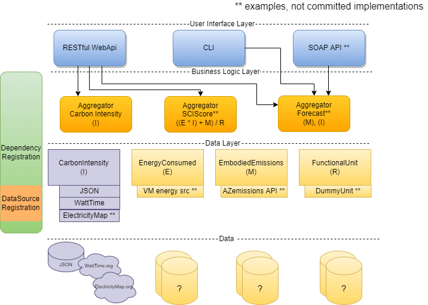

# Architecture Overview

The Carbon Aware SDK is built with three layers where each layer has its own set of responsibilities.
1. User interface layer
2. Business Logic Layer
3. Data Layer

Each layer only has knowledge of its own responsibilities, and specific channels of communication between adjacent layers. This allows the SDK to switch to different implementations withing the same layer without any necessary code changes.

## User Interface Layer
The user interface layer is the entry point for interacting with the SDK. It handles taking the user input and deciding which aggregator(s) should handle processing the input. There are currently 2 different UIs that can be used in the SDK
1. A RESTful WebAPI that can be called using HTTP requests.
2. A command line tool that runs directly on a host machine.

Both UIs access the same logic in the layers below.

## Business Logic Layer
The business logic layer functions as the processor, taking in the user input and figuring out how to fulfill it. It is comprised of a set of aggregators that know what type of data they need and how to calculate the result. 

### Aggregator
Aggregators have knowledge of the different data source interfaces in the data layer. They can either aggregate multiple sources of data into a single response given a request (see example `SCI Score Aggregator` in diagram) or map to a single data source interface, handling all the operations needed by the user for that area of data (see the `Carbon Intensity Aggregator` in diagram).

For example, the `Carbon Intensity Aggregator` handles requests for various carbon emissions information. It can calculate the average carbon emissions over a time period, or the best carbon emissions given a set of locations. It can transform forecasted carbon emissions to suit particular use-cases. It can also just deliver the emissions data points in a standard schema without performing any calculations.

## Data Layer
The data layer is responsible for ingesting data into the SDK. It is comprised of a set of data source interfaces representing the broad categories of data used by the SDK. 

### Data Source Interface
A data source interface defines all the necessary parameters and functions needed to access that category of data. These definitions must be independent of specific data sources and use abstracted input/output parameters expected from the business logic layer. This abstraction enables multiple data sources to extend a single interface and be switched out and configured based on the needs of the operator.

### Data Source Implementation
A data source inherits from a data source interface and does the work of accessing a specific data provider. Each data source the information specific to the data provider it is accessing, including any authentication needs, the format of the request and response, etc. It is also responsible for converting the request from the business logic layer into the required provider request, and similarly, converting the provider response back into the expected result.

## Dependency Registration
The SDK uses dependency injection to load aggregators and data sources based on set environment variables. To register a new dependency, a new ServiceCollectionExtension method must be defined. These dependencies are loaded in a hierarchical structure such that:
1. Each data source defines a `ServiceCollectionExtension` method.
2. All available data sources are registered in the `DataSource.Registration` project.
3. Each aggregator defines a `ServiceCollectionExtension` method where it registers the data sources it intends to use.
4. The `Program.cs` file registers the aggregators at startup
