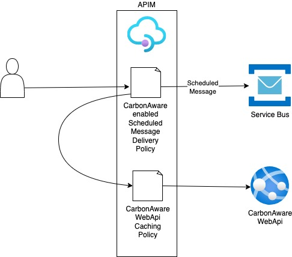

<!-- markdownlint-disable MD024 -->

# Azure API Management Policy

This folder contains sample
[Azure API Management](https://azure.microsoft.com/en-us/products/api-management/)
(APIM)
[policy](https://learn.microsoft.com/en-us/azure/api-management/api-management-howto-policies)
definitions that demonstrate how to integrate the
[Carbon Aware SDK](https://github.com/Green-Software-Foundation/carbon-aware-sdk)
into APIM APIs and change the API behavior based on carbon intensity data. This
sample does not cover creating a full APIM environment but focuses on how the
Carbon Aware SDK can be integrated using
[advanced policies](https://learn.microsoft.com/en-us/azure/api-management/api-management-policies#advanced-policies)
and
[policy expressions](https://learn.microsoft.com/en-us/azure/api-management/api-management-policy-expressions).

By integrating the Carbon Aware SDK at the API gateway level backend API's
and/or downstream consumers are able to do their work at optimal carbon
intensity times without any knowledge of the underlying system that determines
those times. This can be especially valuable in situations where the integration
is with legacy systems or systems that cannot be readily modified to include
carbon awareness.

This sample includes two use cases:

1. [Request routing](#request-routing)
2. [Scheduled message delivery](#scheduled-message-delivery)

In both use cases the Carbon Aware Web.Api is accessed behind an APIM API to
take advantage of response caching. This allows a high volume API to use the
Carbon Aware Web.Api without concerns of being throttled by the underlying
services that the Carbon Aware SDK uses to provide the forecast data.

## Request routing

The request routing policy sample source can be found here -
[request-routing-policy.xml](request-routing-policy.xml).

### Overview

The `request routing` use case involves an APIM policy that routes requests
based on the current carbon intensity in the target regions/data centers. In the
sample policy, requests are routed to the
[backend API](https://learn.microsoft.com/en-us/azure/api-management/backends)
in the region with the lowest carbon intensity.

This use case can be implemented in cases where requests are time sensitive and
cannot take advantage of time shifting for optimal future carbon intensity
usage.

### Dependencies

This use case has the following dependencies:

- Azure API Management
- Carbon Aware SDK Web.Api
  - represented as `my-apim-instance.azure-api.net/emissions/forecasts` in the
    sample code
- A backend web API deployed in multiple regions
  - represented as `my-app-eastus.azurewebsites.net` &
    `my-app-westus.azurewebsites.net` in the sample code

### Enhancements & considerations

This sample policy is a simple implementation to demonstrate how the Carbon
Aware SDK can be integrated into APIM. A few high level enhancements and
considerations are outlined below.

- Integration with hard coded regions is for demonstration purposes only and
  should be automated or an alternate approach for region configuration should
  be considered.
- It may be necessary to include other factors into the routing decision. This
  sample focuses purely on carbon intensity.

## Scheduled message delivery

The scheduled message delivery policy sample source can be found here -
[scheduled-message-delivery-policy.xml](scheduled-message-delivery-policy.xml).

### Overview

The `scheduled message delivery` use case involves a policy that is carbon aware
and exposes a service bus queue through APIM. Message delivery is scheduled
based on the optimal future carbon intensity forecast. This use case is designed
for non time-sensitive workloads that can tolerate delayed processing.

This implementation takes advantage of Azure Service Bus
[scheduled messages](https://learn.microsoft.com/en-us/azure/service-bus-messaging/message-sequencing#scheduled-messages)
where messages can be submitted to a queue or topic for delayed processing.
Scheduled messages don't materialize in the queue until the defined enqueue time
which is defined using the `ScheduledEnqueueTimeUtc` message property.

### Dependencies

This sample uses the following services/components:

- Azure API Management
- Azure Service Bus
- Carbon Aware SDK Web.Api
  - represented as `my-apim-instance.azure-api.net/emissions/forecasts` in the
    sample code

### Enhancements & considerations

This sample policy is a simple implementation to demonstrate how the Carbon
Aware SDK can be integrated into APIM. A few high level enhancements and
considerations are outlined below.

- The specific message delivery time is based on the most optimal carbon
  intensity forecast value. To provide more control to the caller the request
  can include a time window that can be used to select the lowest carbon
  intensity value in the specified window.
- This sample is using an API facade on top of a service bus queue to
  incorporate carbon awareness. Additional response information would most
  likely be needed in a real world scenario.
